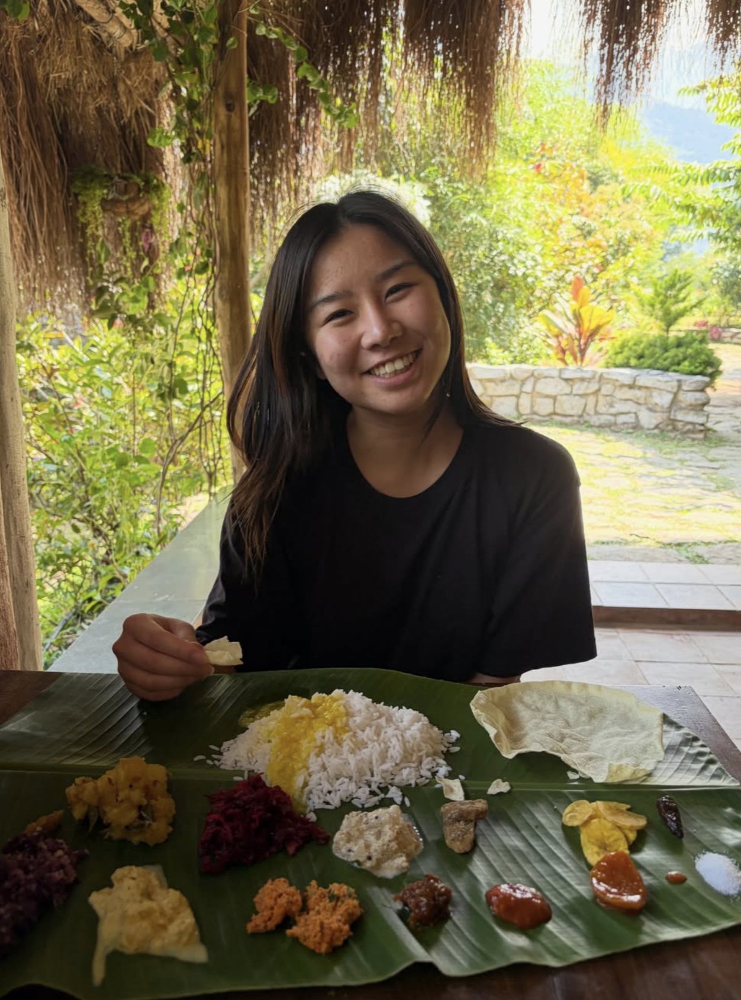
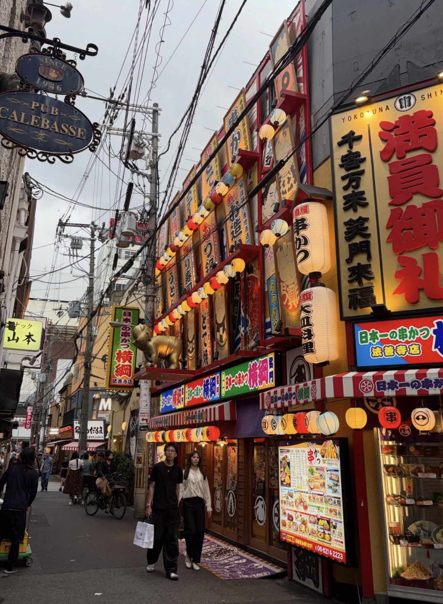

# Tam Nguyen 🌸

Business Intelligence & Process Management student at HWR Berlin · working at SAP Signavio · 📍 Berlin

---

### ✨ About me

I'm from a small village called Schneeberg in Odenwald, Germany. After school I moved to Madrid for a year, then came to Berlin for uni. Did an exchange semester in Shanghai, and this year I traveled through China, South Korea, Japan, and India.

I like going out, exploring new places, and I just finished my thesis on AI in companies.

---

### 📷 Photos

---

### 🎓 Education

| Period | School | Degree |
|:---|:---|:---|
| 2022 – now | HWR Berlin | BSc Business Intelligence & Process Management |
| 2024 – 2025 | USST Shanghai 🇨🇳 | Exchange Semester |
| 2018 – 2021 | Frankenlandschule Walldürn | Abitur |

---

### 💼 Work experience

| Period | Company | Role |
|:---|:---|:---|
| 2026 – now | SAP Signavio, Berlin | Working Student — AI tools for consultants |
| 2025 – 2026 | Microsoft, Berlin | Working Student — AI go-to-market Germany |
| 2025 | SAP, Berlin | Intern — strategy & operations |
| 2023 – 2025 | Vattenfall, Berlin | Working Student — product management, B2B energy |
| 2021 – 2022 | Selectra, Madrid 🇪🇸 | Sales Consultant — moved to Spain after school, learned Spanish |

---

### 🗺️ My journey

Schneeberg → Madrid → Berlin → Shanghai → Berlin

<iframe src="map.html" width="680" height="300" style="border:none; border-radius:10px; margin-top:8px;"></iframe>
